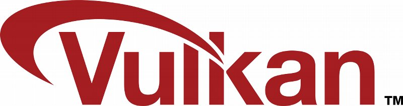

# 第一章

## 简介

### 引言

本教程主要讲述Vulkan计算机图像API基本的使用方法。Vulkan是由Khronos Group发起制定的一种新的图像API，它针对现代显卡设备提供了更好的抽象。相比OpenGL 和 Direct3D，Vulkan API允许开发者在应用开发中直接操作较低层级的接口，从而设计实现高性能的图形渲染。Vulkan接口设计背后的这种理念和Direct3D 12 以及苹果的Metal非常相似，相比而言，Vulkan还有完全跨平台的优势，目前Window， Linux和Android系统都有支持Vulkan的SDK以及相应的显卡驱动。

但是，Vulkan提供低层级接口使应用程序可以设计开发显著提供图形性能，获得这种优势带来的负面影响就是Vulkan的API相当繁杂。所有设计图形API接口的细节都需要应用层来进行设置，其中就包含了初始化帧缓冲区（frame buffer）以及缓冲区（buffers）纹理贴图的内存管理等。Vulkan接口驱动层也会相应的减少状态的判断，这样应用程序就增加更多的额外判断确保程序正确执行。

这里需要指出的是：Vulkan并不是适合所有的图形开发者。它主要是针对那些追求极致的图形性能的开发者。如果你只是对一般的游戏开发感兴趣，你可能更加愿意使用OpenGL和Direct3D接口。 另外一种方法就是使用像Unreal Engine 或者Unity这样的渲染引擎，这些引擎提供了基于Vulkan实现的高等级API，通过这些高等级API使用Vulkan功能。

在阅读本教程前，我们需要预先准备如下的环境：

- 支持Vulkan的显卡和驱动
- 具有C++编程开发能力
- 支持C++11的编译开发环境
- 具备有基本的3D 计算机图形相关知识

本教程不需要具备OpenGL和Direct3D的预报知识，但是需要具备基本的3D计算机图形相关的知识。比如本教程并不会去解释投射矩阵相关的数学原理，读者需要提前了解3D计算机图形学的相关知识。

### 文档的结构

首先本教程会总体描述Vulkan是如何运行的，并且如何使用Vulkan在屏幕上绘制一个三角形。当你理解每一个小的步骤在整个全景图中的位置时，你就会更加理解每一小步的具体意义和目的。

之后，本教程会搭建一个Vulkan SDK的开发实验环境。主要会涉及如下的开源库和集成编译环境

- GLM库，主要提供线性代数相关API接口
- GLFW库，主要提供桌面窗口创建功能
- 在windows构建Visual Studio集成开发环境
- 在Ubuntu上构建基于GCC编译工具的开发环境

在教程完成一个基本的三角渲染后，会具体讲解绘制三角形涉及的各个模块。每一个章节会遵循如下的结构：

- 介绍新的概念和目的
- 使用涉及到的所有API并且集成到程序中
- 将实现抽象成帮助函数

尽管本教程每一章都是前面章节相关联的，同时每一章也是介绍Vulkan相关特性的一个独立章节。这意味着整个教程其实是关于Vlukan的一本参考书籍。

正如上文所述，Vulkan API有很多繁琐的参数设置，这种设计能够提供对物理显卡最大限度的控制。但是这也导致了需要操作许多步骤才能完成诸如创建纹理这样基本的操作。并且多次操作时需要反复重复调用这些步骤。因此，本教程总结抽象了很多帮助函数。

当你使用Vlukan接口完成最基本的三角形绘制后，你会开始逐渐扩展这个基本的程序，比如增加线性变换，增加纹理贴图和显示3D模型等。

如果你之前有过使用3D图形渲染接口做开发的经历。你会理解在屏幕上绘制一个三角形其实需要很多的步骤。同样，Vlukan也会由很多的初始化步骤。你会发现这些步骤是很容易理解的并且并不是冗余的操作，请记住，一旦你调同了这个三角形的显示，再此基础上开发带贴图的3D模型显示就不需要再花费额外的工作了。

你已经准备好潜心学习面向未来的高性能图形API接口吗？我们开始吧！

